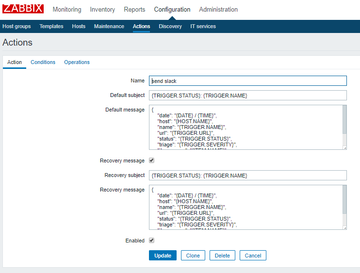

# slack.py

## Requirements

You don't need install any libraries and packages.

- python 2/3
  - urllib
  - json

## Usage

### Place this scripts

In generaly, place `slack.py` on `/usr/lib/zabbix/alertscripts/`

### Media types

Set parameter like this image.

- `{ALERT.SENDTO}`
- `{ALERT.MESSAGE}`


### Actions

Set default message like this picture.

```json
{
    "date": "{DATE} / {TIME}",
    "host": "{HOST.NAME}",
    "name": "{TRIGGER.NAME}",
    "url": "{TRIGGER.URL}",
    "status": "{TRIGGER.STATUS}",
    "triage": "{TRIGGER.SEVERITY}",
    "item_name": "{ITEM.NAME}",
    "item_value": "{ITEM.VALUE}"
}
```



### User profile/Media

Set slack media and send to slack [incoming webhook URL](https://api.slack.com/incoming-webhooks).


### Verify

You can verify action results on [Action log](https://www.zabbix.com/documentation/3.0/manual/web_interface/frontend_sections/reports/action_log).

## LICENSE

MIT